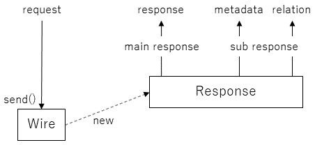
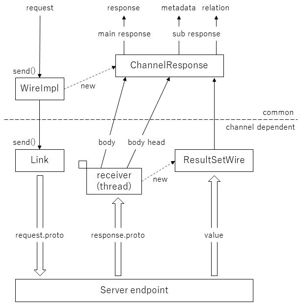
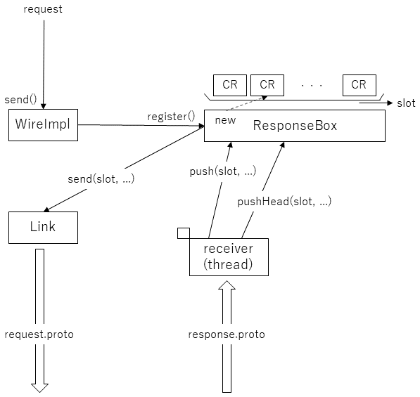
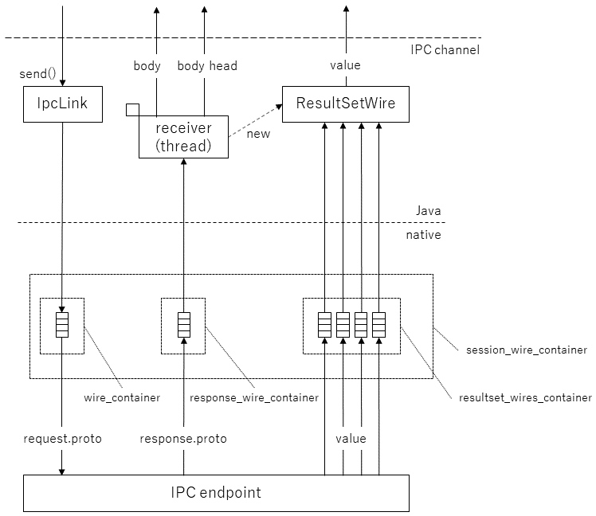
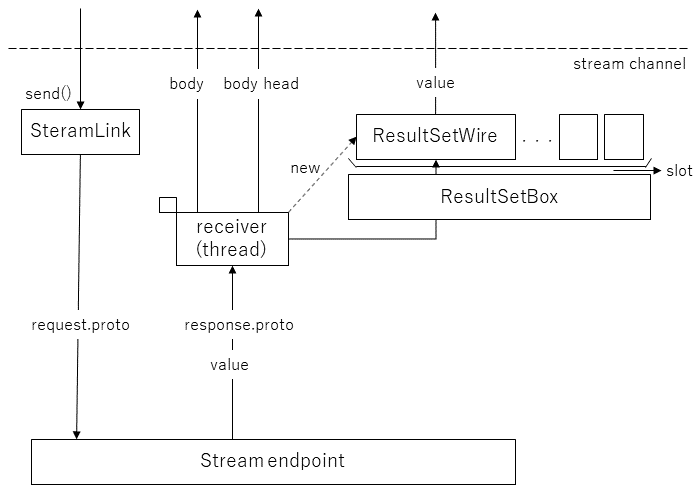

# Channel Design Document
2022.11.16
NT horikawa

このドキュメントでは、tsubakuro - tateyama間の通信路（channel）の設計を記す。

## Channelの役割
Channelは、クライアント（tsubakuro）からサーバ（tateyama）への処理要求、および、逆方向に送られる処理結果を通信して受け渡す役割を持つ。
なお、処理結果には、データベースから読み出した値（および、それらを使って演算した結果）を含む。

## 本ドキュメントで使用する名称
* session: クライアントとサーバ間の接続単位。各sessionは論理的に独立しており、互いに干渉しない
* message: protocol buffersでencodeされたデータ、requestとresponseの２種類
* value: data channelにより転送するデータ、例えば、データベースから読み出した値や、それらを使って演算した結果
* channel: messageやvalueを、各々を区別した状態で転送する手段、単なるバイト列を転送する通信媒体の上位に位置する概念
  request channel, response channel, data channelの３種類
* header: channelによる転送操作のためにpayloadに付与される固定長データ
* payload: channelの上位層が扱う可変長データ、messageとvalueの２種類
* transfer unit: Channelの１回の送受信操作で転送するmessageまたはvalueに対応するバイト列
* 通信媒体: transfer unitとなったmessageやvalueを転送する手段


## 通信の概要
### channelの種類
* request channel (tsubakuro → tateyama) 1本/session
* response channel (tateyama → tsubakuro) 1本/session
* data channel (tateyama → tsubakuro) n本/session, n >= 0<br>
impl memo:<br>
　IPCの通信媒体は、各channelに別の名前を付与したメモリ領域を使用する。<br>
　Streamの通信媒体は1本のbyte stream通信路を共用する。message種類の区別はheaderのtype情報により行う。

### 通信路を使って送られる情報
* request/response message, value
* 制御情報
  * 切断（close）要求
  * data終了通知
  * 各種制御要求へのack

impl memo: 各情報は、下記formatのtransfer unitの形式にまとめられて1回の送受信操作で転送される。
* transfer unit: header + payload
* header: 下記の3種類
 * request header : slot, length
 * response header : slot, type, length
 * data header : length
* payload: messageやvalueに応じた形式（channel層では既定しない）<br>
slotについては、ResponseBoxの項参照


### 通信の基本動作
* クライアントがrequest messageをサーバに送り、その処理結果をサーバがresponse messageとしてクライアントに返す一対のデータ転送を基本とする。
* response messageとvalueの2種類のデータ転送を必要とするrequestもある。
impl memo: responseはbody, そしてvalue送信実施を伝えるmessageはbody_headとしてtateyamaのendpointから送信される。



## Channel
### 基本構造
* request messageはWire::send()によりサーバに送信する。
* response messageは、send()のreturn valueから取り出すResponseから取得する。
* valueは、ResponseのsubChannelをopenして得られるInputStream経由で受け取る。<br>
impl memo: Channelを使う通信の場合、Responseを実装したChannelResponseを使う。



### API
* Wire::send(int serviceId, byte[] payload) -> ```Future<ChannelResponse>```
* ChannelResponse::waitForMainResponse(), waitForMainResponse(long timeout, TimeUnit unit) -> ByteBuffer
* ChannelResponse::openSubResponsee(String id) -> InputStream<br>
impl memo: idが"metadata"の場合はmetadata, "relation"の場合はResultSetを読み込むInputStreamが返される。

### 通信媒体
#### 種類
IPCとstreamの２種類を提供する。
* 共有メモリ（IPC）: 名前で管理されるメモリ領域<br>
  impl memo: boost shared memoryを使っ通信路を実装
* stream：byte streamを受け渡す通信路<br>
  impl memo: TCP/IPをjava層からアクセスする通信路を実装

#### 通信媒体の動作
* Link::send()はWireImplから渡されたrequest messageをサーバに送信する。
* サーバから送信されたresponse messageはreceiverスレッドが受け取り、それをChannelResponseに設定する。
* response messageがbody_headの場合、receiverスレッドはvalueを受信するResultSetWireを作成し、それをChannelResponseに設定する。


## アーキテクチャ
### IPC, Stream共通部分
#### ChannelResponse
##### 概念的なメンバ
* ByteBuffer mainResponse;
* InputStream metadata;
* InputStream dataChannel;

##### API
* waitForMainResponse() -> ByteBuffer
  * response channelで転送されたpayload
* openSubResponse(String id) -> InputStream
  * idが"metadata"の場合、metadata
  * idが"relation"の場合、dataChannel

#### ResponseBox
##### 役割
WireImpl::send()により送信したrequest messageと、サーバから受け取るresponse messageの対応付けを行う。<br>
具体的には、1) request messageに識別情報を付与してサーバに送信し、2)サーバはresponse messageに対応するrequest messageの識別情報をresponseに付与してクライアントに送信することにより、request messageとresponse messageの対応付けを可能とする。ResponseBoxは、responseを受け取っていないrequestに対応するChannelResponseを格納する役割を持つ。



##### 概念的なメンバ
ChannelResponseの配列、そのindexをslotと称する

##### API
* register(byte[] header, byte[] payload) -> ChannelResponse
  * ChannelResponseを作成して空slotに登録した上で、request channel経由でrequest messageを送信する
* push(int slot, byte[] payload)
  * response channelから受け取ったpayload(body)をrequestに対応するChannelResponseに登録し、ChannelResponseの配列のslot位置を解放する
* pushHead(int slot, byte[] payload, ResultSetWire resultSetWire)
  * response channelで転送されたpayload(bodyHead)に対応するmetadataとresultSetWireをrequestに対応するChannelResponseに登録する


### IPC channel
#### IPC channelのみで使用する名称
* コンテナ：通信路を束ねて管理するオブジェクト。
  * sessionが使用する全通信路はsessionコンテナに格納する。
  * １つのResultSetを転送するdata channel群はdata channelコンテナに格納する（次項参照）。<br>
sessionコンテナは、request channelとresponse channelが各１本と複数（0個以上）のdata channelコンテナを格納する。

* data channelコンテナについて（補足）
  * ResultSet転送に、複数のwriterが関与する場合は、各writerにdata channelを持たせ、それらを１つのdata channelコンテナに格納する。



#### java層
###### IpcLink
* IpcLink(String name)
  * nameで指定される共有メモリを使うIPC mediaを扱うインスタンスを作成する
* send(int slot, byte[] frameHeader, byte[] payload)
  * IPC mediaのrequest channel経由でheaderとpayloadから成るrequestを送信する
* createResultSetWire() -> ResultSetWire
  * IPC mediaを使うdata channel containerを作成する
* close()
  * 当該IPC mediaをcloseする

##### ResultSetWire
* ResultSetWire(long sessionWireHandle)
  * sessionWireHandleで指定されるIPC media上に作成されるdata channel containerを扱うインスタンスを作成する
* connect(String name) -> ResultSetWire
  * 当該data channel containerをnameで指定される共有メモリ領域に接続する
* getByteBufferBackedInput() -> InputStream
  * 当該data channel containerから読み込んだdata streamを読み込むInputStreamを提供する
* close()
  * 当該data channel containerをcloseする

#### JNI層
java層とnative層を接続する層。

##### session wire container
* openNative(String name) -> long (~wireHandle)
  * sessionを開設する
* sendNative(long wireHandle, int slot, byte[] header, byte[] payload);
  * sessionのrequest channel経由でrequest messageを送信する
* awaitNative(long wireHandle) -> int (~slot)
  * sessionのresponse channelにresponse messageが到着するのを待つ
* getInfoNative(long wireHandle) -> int (~info)
  * response channelに到着したresponse messageの種類（type）情報を取得する
* receiveNative(long wireHandle) -> byte[] (~payload)
  * response channelからresponse messageを取り出し、そのpayloadを返す
* closeNative(long wireHandle)
  * sessionを終了する
* destroyNative(long wireHandle)
  * sessionコンテナを破棄する


##### data channel container
* createNative(long sessionWireHandle, String name) -> long (~data channel container handle)
  * data channel containerを作成する
* getChunkNative(long handle) -> ByteBuffer (~payload)
  * data channelに到着したvalueを取得する
* disposeUsedDataNative(long handle, long length)
  * data channelに到着したvalueを使用済みとして破棄する
* isEndOfRecordNative(long handle) -> boolean
  * data channelによるvalue転送（サーバによるvalueの書き込み）が完了しているかどうかを調べる
* closeNative(long handle)
  * data channelからのvalue読み込みを終了する
impl memo: IPCでは、データのコピーを避けるため、data channel内のバッファに格納されたデータを（コピーすることなく）InputStreamとして上位に提供する。

#### native層API
##### 全通信路共通
* read()
  * 通信路に書き込まれたmessageのpayloadを読み出し、bufferにコピーする
  * messageが書き込まれていない場合はblockして待つ
* dispose()
  * 通信路に書き込まれた先頭のmessageを廃棄する
  * 次のread()やpeek()の対象は、dispose()したmessageの次に書き込まれるmessageとなる
* write()
  * 通信路にmessageを書き込む
  * 通信路がbuffer fullにより書き込みできない場合はblockして待つ

##### request channel
* peek()
  * 通信路に書き込まれたmessageのheader部分を取り出す
  * messageが書き込まれていない場合はblockして待つ

##### data channel
* get_chunk()
  * 通信路にmessageのpayload部分を取り出す

##### Sessionコンテナ
* create_resultset_wire() -> resultset_wires_container*
  * data channelを作成する。


### Stream channel
Stream channelでは、1本のstream転送路により総てのmessageとvalueの受け渡しを行う。このため、transfer unitは、TLV（type, length, value）形式とする。



#### ResultSetBox（Stream channelのみで使用）
##### 役割
ResponseBoxと同様、ResultSetの受け取りを開始してから終了するまでの間、body headメッセージにより作成したResultSetWireとサーバから受け取るvalueの対応付けを行う。但し、slot番号の割り当ては（ResponseBoxと異なり）サーバが行う。<br>
具体的な手順は、1)サーバから送られるResultSet転送開始を示す制御メッセージ（ResultSet名とslot番号を含む）受信によりクライアントはslot番号とResultSetWireの対応付けを開始する、2)それ以降にサーバから送られるvalueのheaderにはslot番号とwriter番号が付与されているので、それに従って適切なResultSetWireにvalueを受け渡す、3)ResultSet転送終了時にはサーバからResultSet転送終了を示す制御メッセージが送られるので、クライアントはそれを受け取ると、制御メッセージに含まれるslot番号を解放し、当該slot番号が再利用可能になったことを制御メッセージをサーバに送信する。

##### API
* register(String name, ResultSetWireImpl resultSetWire)
  * ResultSetのnameとresultSetWireの対応付けを登録する 
* pushHello(String name, int slot)
  * ResultSetのnameとslotの対応付けを登録する。register()とpushHello()の両方がcallされることにより、slotとresultSetWireが対応付けられる。
  * receiverスレッドがRESPONSE_RESULT_SET_HELLO制御メッセージ（次項）を受信したときにcallするメソッド
* push(int slot, int writerId, byte[] payload)
  * 受信したvalueをキューイングする
  * receiverスレッドがRESPONSE_RESULT_PAYLOAD（value）を受信したときにcallするメソッド
* pushBye(int slot)
  * ResultSetWire経由のvalue受け渡しを正常に完了させる。
  * receiverスレッドがRESPONSE_RESULT_SET_BYE制御メッセージ（次項）を正常に受信したときにcallするメソッド
* pushBye(int slot, IOException e)
  * ResultSetWire経由のvalue受け渡しを例外で完了させる。
  * receiverスレッドがRESPONSE_RESULT_SET_BYE制御メッセージ（次項）を受信した際、例外が発生したときにcallするメソッド

#### transfer unitの種類
* client -> server
  * REQUEST_SESSION_HELLO: セッション開始をサーバに伝える制御メッセージ
  * REQUEST_SESSION_PAYLOAD: request message
  * REQUEST_RESULT_SET_BYE_OK: ResultSetWireに関連付けられていたslot番号が再利用可能になったことをサーバに伝える制御メッセージ
  * REQUEST_SESSION_BYE: セッション終了をサーバに要求する制御メッセージ。サーバは、総てのmessage, value, 制御メッセージを送信しない状態に移行した後にRESPONSE_SESSION_BYE_OK制御メッセージを送信する。

* server -> client
  * RESPONSE_SESSION_PAYLOAD: response message（body head以外）
  * RESPONSE_RESULT_SET_PAYLOAD: value
  * RESPONSE_SESSION_HELLO_OK: セッション開始要求がacceptされたことを示す制御メッセージ
  * RESPONSE_SESSION_HELLO_NG: セッション開始要求がdeclineされたことを示す制御メッセージ
  * RESPONSE_RESULT_SET_HELLO: ResultSetの転送開始を示す制御メッセージ
  * RESPONSE_RESULT_SET_BYE: ResultSetの転送終了を示す制御メッセージ
  * RESPONSE_SESSION_BODYHEAD: response message（body head）
  * RESPONSE_SESSION_BYE_OK: セッション終了要求のacceptを示す制御メッセージ